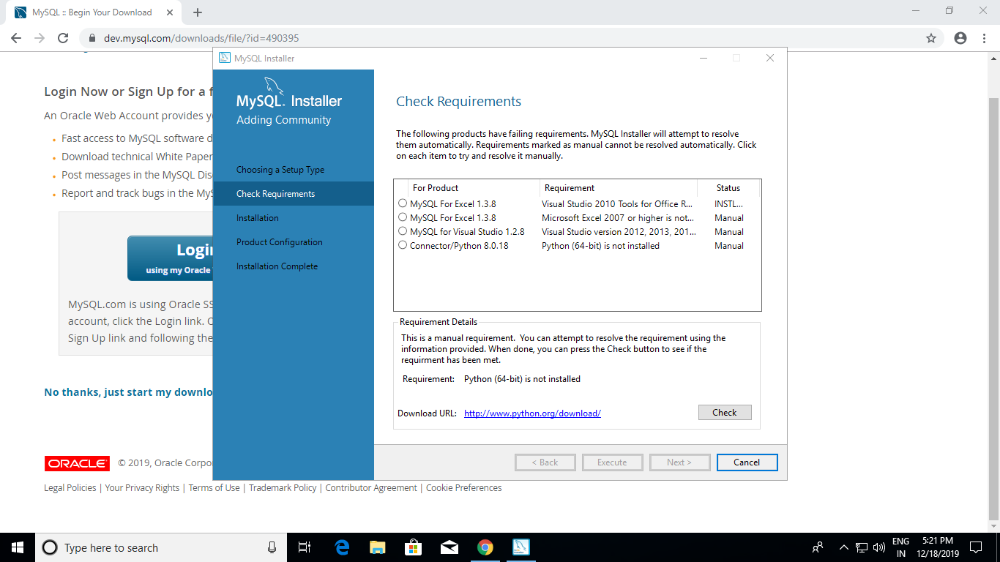

# Steps to install MySQL in windows machine.

### Objective
  To Install My SQL in windows machine.
  
## Information

## Prerequisites
  Download the installer from :point_right: [MySql website](https://dev.mysql.com/downloads/file/?id=490395).

## Instructions
  Uninstall all versions of Visual C++ Redistributable from your system to avoid any failures in later stage.

